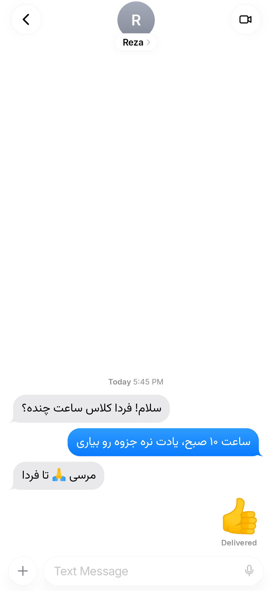

<div align="center">


# Liquid Messages

**پیام‌رسان پیامک و MMS برای اندروید با ظاهر iOS و شیشه‌ی مایع واقعی**

[](https://github.com/abtin-f/liquid-messages/releases/latest)
[](https://github.com/abtin-f/liquid-messages/actions/workflows/build.yml)

[](LICENSE)

[English](README.md) · **فارسی**

</div>

---

<div dir="rtl">

**Liquid Messages** یک اپ کامل **پیامک و MMS پیش‌فرض** برای اندرویده که ظاهر و حسش از پیام‌رسان iOS 26 الهام گرفته: حباب‌ها با دم منحنی، دکمه‌های شیشه‌ای که واقعاً پشتشون رو می‌شکنن و بلور می‌کنن، انیمیشن‌های فنری، کارت نقشه برای لوکیشن و صفحه‌ی تنظیمات دقیقاً مثل آیفون. همه‌چیز روی گوشی خودت می‌مونه؛ نه حساب کاربری، نه سرور، نه ردیابی.

## تصاویر

</div>

<table>
  <tr>
    <td align="center"><br><sub>لیست گفتگوها</sub></td>
    <td align="center"><br><sub>چت، لینک و کارت نقشه</sub></td>
    <td align="center"><br><sub>حالت تاریک</sub></td>
  </tr>
  <tr>
    <td align="center"><br><sub>منوی + و متن فارسی</sub></td>
    <td align="center"><br><sub>چت گروهی MMS</sub></td>
    <td align="center"><br><sub>تنظیمات</sub></td>
  </tr>
  <tr>
    <td align="center"><br><sub>اطلاعات مخاطب</sub></td>
    <td align="center"><br><sub>پیام جدید</sub></td>
    <td align="center"><br><sub>گفتگوی فارسی</sub></td>
  </tr>
</table>

<div dir="rtl">

## قابلیت‌ها

**پیام‌رسانی**
- اپ پیش‌فرض کامل پیامک: ارسال، دریافت، گزارش تحویل، دو سیم‌کارت، و «Not Delivered — برای ارسال دوباره لمس کن»
- **MMS**: عکس، دوربین، فایل و چت گروهی (با رمزگذار و رمزگشای MMS که از صفر نوشته شده)
- **Send Later**: پیام زمان‌بندی‌شده که بعد از ری‌استارت گوشی هم فرستاده می‌شه
- ری‌اکشن روی پیام، افکت ارسال و استیکر
- ارسال **لوکیشن** به‌صورت کارت نقشه (با OpenStreetMap، بدون نیاز به سرویس‌های گوگل)
- لینک، ایمیل و شماره تلفن قابل لمس (شماره‌های ایرانی هم شناخته می‌شن)
- بلاک کردن شماره، بی‌صدا کردن گفتگو، کپی و حذف پیام

**طراحی**
- چیدمان دقیق iOS: دم حباب، گروه‌بندی پیام‌ها، زمان‌ها، عنوان بزرگ و تنظیمات گروه‌بندی‌شده
- **شیشه‌ی مایع واقعی**: بلور زنده و یه شیدر عدسی که لبه‌ها رو مثل شیشه‌ی واقعی خم می‌کنه (اندروید ۱۳ به بالا)
- انیمیشن جستجو مثل iOS، صفحه‌ی پیام جدید که از پایین بالا میاد، و سوییچ‌های iOS
- حباب آبی یا سبز، حالت روشن و تاریک
- پشتیبانی کامل از **فارسی و راست‌به‌چپ**: جهت هر پیام جدا تشخیص داده می‌شه، با فونت وزیرمتن

**حریم خصوصی**
- پیام‌ها فقط به‌صورت پیامک یا MMS عادی از طریق اپراتور جابه‌جا می‌شن
- اینترنت فقط برای دانلود نقشه‌ی کارت‌های لوکیشن استفاده می‌شه

## نصب

۱. فایل **`LiquidMessages-v1.6.1.apk`** رو از [آخرین نسخه](https://github.com/abtin-f/liquid-messages/releases/latest) دانلود کن.

۲. روی گوشی بازش کن و اجازه‌ی نصب از این منبع رو بده. اگه Play Protect هشدار داد، **More details ← Install anyway** رو بزن.

۳. اپ رو باز کن و **Set as Default SMS App** رو بزن.

> **محدودیت اندروید ۱۳ به بالا:** اندروید اجازه نمی‌ده اپی که از فایل نصب شده، اپ پیامک پیش‌فرض بشه، مگه یک بار خودت اجازه بدی. خود اپ مراحلش رو نشون می‌ده: **App info ← ⋮ ← Allow restricted settings** و بعد *Try Again*. توی سامسونگ اگه این گزینه نبود، اول **Settings ← Security and privacy ← Auto Blocker** رو خاموش کن.

**نصب از کامپیوتر (بدون هیچ‌کدوم از این مراحل):** USB debugging رو روشن کن، گوشی رو با کابل وصل کن و `install.bat` رو اجرا کن (ویندوز). اپ نصب می‌شه، پیش‌فرض می‌شه و دسترسی‌هاش داده می‌شه.

## ساخت از روی سورس

پیش‌نیاز: JDK 17 و Android SDK 34.

</div>

```bash
git clone https://github.com/abtin-f/liquid-messages.git
cd liquid-messages
./gradlew assembleDebug
./gradlew testDebugUnitTest
```

<div dir="rtl">

## منابع و تشکر

- فونت‌های [Inter](https://rsms.me/inter/) و [وزیرمتن](https://github.com/rastikerdar/vazirmatn) (مجوز SIL Open Font)
- داده‌های نقشه از مشارکت‌کنندگان [OpenStreetMap](https://www.openstreetmap.org/copyright)

## سلب مسئولیت

Liquid Messages یک پروژه‌ی مستقله و **هیچ ارتباطی با شرکت Apple نداره** و مورد تأیید اون نیست. ظاهر اپ از iOS الهام گرفته، ولی تمام کد و طرح‌ها از صفر ساخته شدن.

## مجوز

[MIT](LICENSE) © 2026 abtin-f

</div>
