<div align="center">

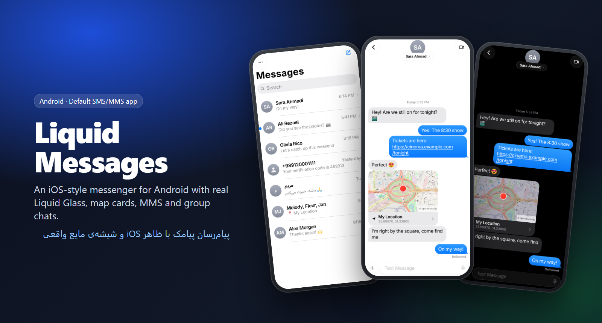

# Liquid Messages

**An iOS-style SMS & MMS messenger for Android — with real Liquid Glass.**

[](https://github.com/abtin-f/liquid-messages/releases/latest)
[](https://github.com/abtin-f/liquid-messages/actions/workflows/build.yml)


[](LICENSE)

**English** · [فارسی](README.fa.md)

</div>

---

Liquid Messages is a complete **default SMS/MMS app** for Android, designed to look and feel like the messaging app on iOS 26: curled bubble tails, floating glass controls that actually refract what's behind them, spring animations, map cards for shared locations and a settings screen straight out of an iPhone. Everything stays on your phone — no accounts, no servers, no tracking.

## Screenshots

<table>
  <tr>
    <td align="center">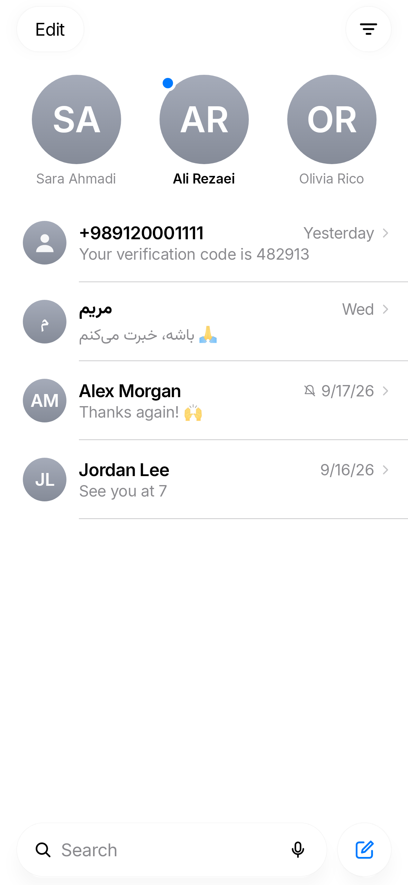<br><sub>Conversations</sub></td>
    <td align="center">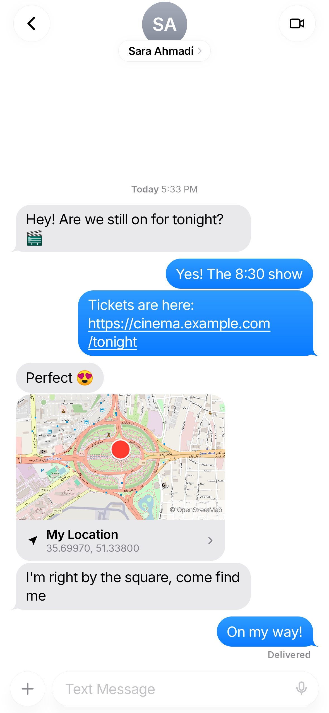<br><sub>Chat · links · map card</sub></td>
    <td align="center">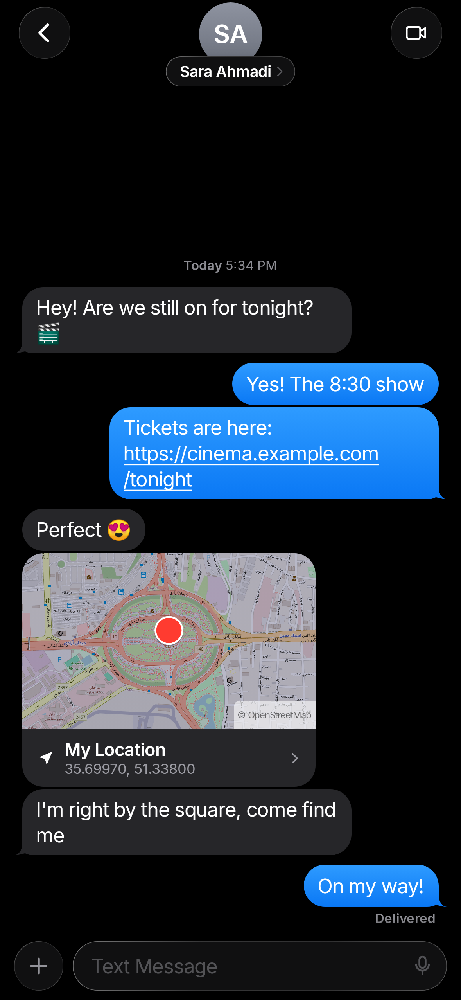<br><sub>Dark mode</sub></td>
  </tr>
  <tr>
    <td align="center">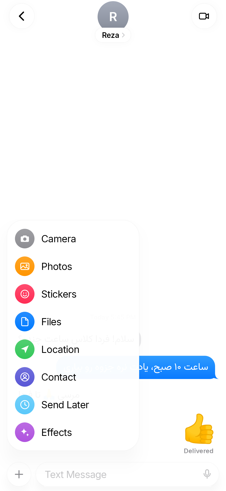<br><sub>“+” menu · Persian RTL</sub></td>
    <td align="center">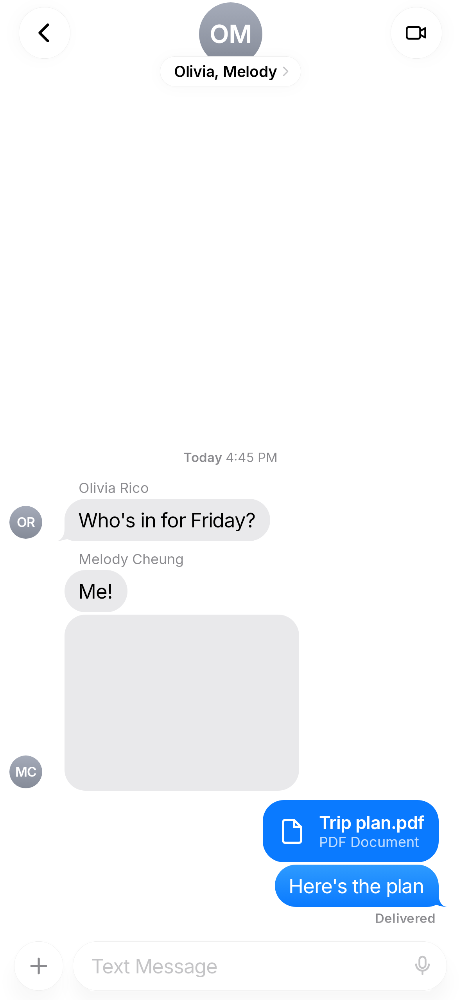<br><sub>Group MMS</sub></td>
    <td align="center">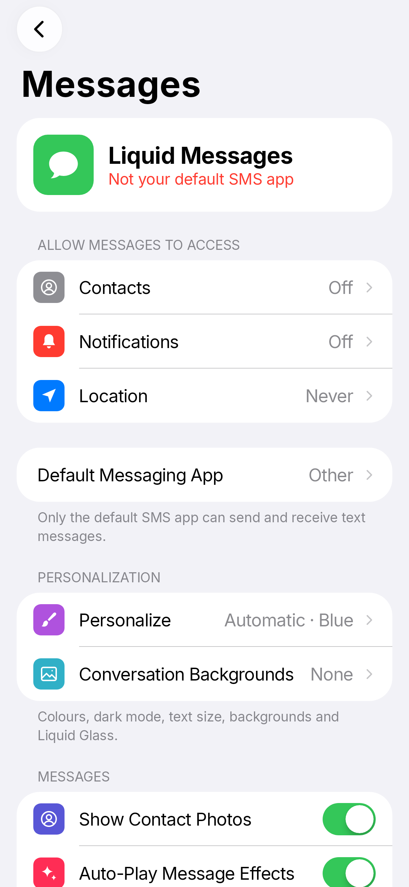<br><sub>Settings</sub></td>
  </tr>
  <tr>
    <td align="center">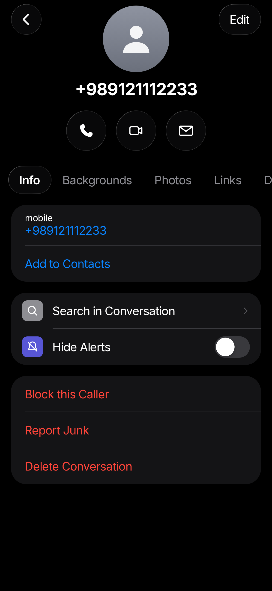<br><sub>Contact details</sub></td>
    <td align="center">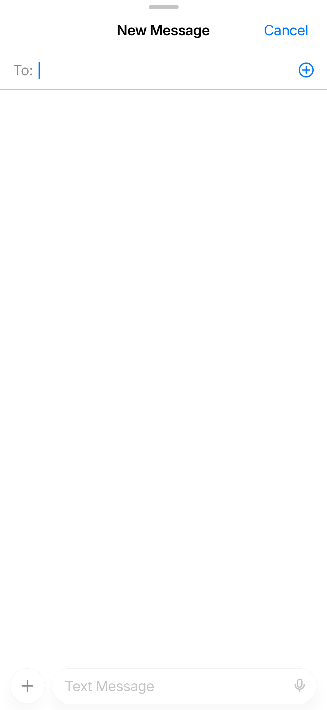<br><sub>New message sheet</sub></td>
    <td align="center">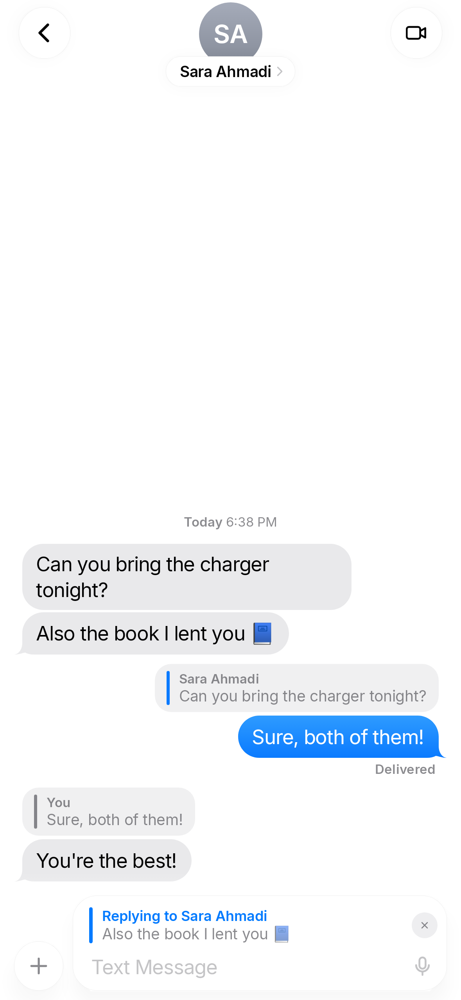<br><sub>Swipe to reply</sub></td>
  </tr>
  <tr>
    <td align="center">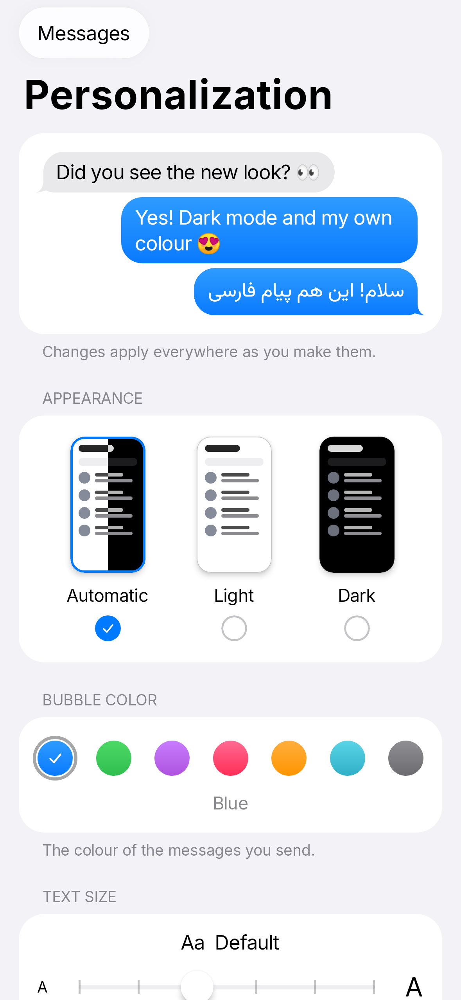<br><sub>Personalization</sub></td>
    <td align="center">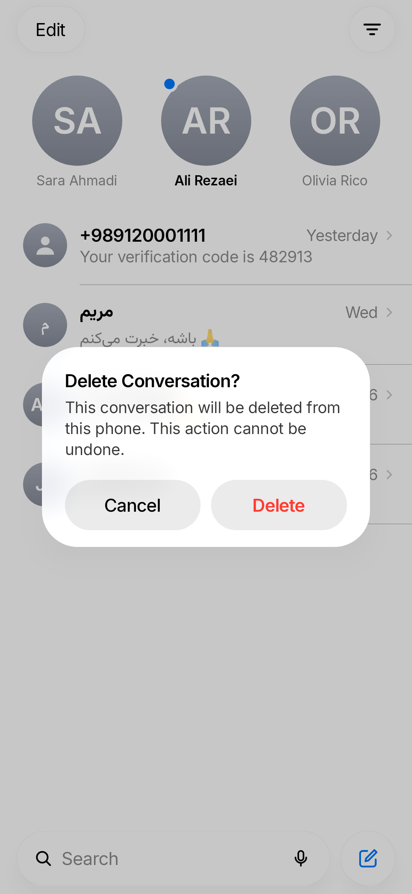<br><sub>iOS alerts</sub></td>
    <td align="center">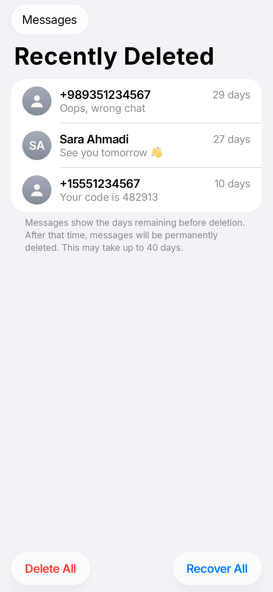<br><sub>Recently Deleted</sub></td>
  </tr>
</table>

## Features

**Messaging**
- Full default SMS app: send, receive, delivery reports, dual-SIM, “Not Delivered — tap to retry”
- **MMS**: photos, camera, files, group chats — with a from-scratch MMS PDU encoder/decoder
- **Send Later** (scheduled messages that survive reboots)
- **Swipe to reply** with quoted messages
- Tapback reactions, stickers, and send-with-effect animations that also play on the recipient's phone
- Share your **location** as a map card (OpenStreetMap, no Google services needed)
- Tappable links, e-mails and phone numbers (Iranian numbers included)
- Block numbers, hide alerts per conversation, copy / delete messages

**Design**
- Pixel-matched iOS layout: bubble tails, grouping, timestamps, large titles, grouped settings
- **Real Liquid Glass**: live blur + an AGSL lens shader that bends content at the edges (Android 13+)
- iOS-style search animation, page-sheet “New Message”, push transitions, iOS switches
- Blue or green bubbles, light & dark mode
- First-class **Persian / RTL**: each message picks its own direction; Vazirmatn font for Persian

**Privacy**
- Messages never leave your phone except as normal SMS/MMS through your carrier
- Internet is used only to download map tiles for location cards

## Install

1. Download **`LiquidMessages-v1.7.0.apk`** from the [latest release](https://github.com/abtin-f/liquid-messages/releases/latest).
2. Open it on your phone and allow installing from this source. If Play Protect warns about an unknown app, tap **More details → Install anyway**.
3. Open the app and tap **Set as Default SMS App**.

> **Android 13+ “restricted setting”:** Android blocks sideloaded apps from becoming the SMS app until you allow it once. The app shows the steps: **App info → ⋮ → Allow restricted settings**, then *Try Again*. On Samsung, turn off **Settings → Security and privacy → Auto Blocker** first if that option is missing.

**Install from a PC (skips all of the above):** enable USB debugging, connect the phone and run `install.bat` (Windows). It installs the APK, makes it the default SMS app and grants its permissions over `adb`.

## Build from source

Requirements: JDK 17, Android SDK 34.

```bash
git clone https://github.com/abtin-f/liquid-messages.git
cd liquid-messages
./gradlew assembleDebug          # app/build/outputs/apk/debug/
./gradlew testDebugUnitTest      # unit + screenshot tests (Robolectric/Roborazzi)
```

Release builds are signed with a key read from `keystore.properties` (not included in the repo).

## Architecture

| Layer | What's there |
|---|---|
| `data/sms` | Telephony provider access, SMS sending with sent/delivered tracking |
| `data/mms` | `MmsPdu` (pure-Kotlin OMA-MMS codec), `MmsStore` (content://mms), `MmsTransport` (platform MMS service), `MmsCoordinator` |
| `data/location` | Map-link parsing and OpenStreetMap snapshot rendering |
| `data/schedule` | Send Later: AlarmManager + reboot rescheduling |
| `ui/glass` | The Liquid Glass engine: backdrop recording, RenderEffect blur, AGSL lens shader |
| `ui/*` | Jetpack Compose screens (MVVM, `StateFlow`), iOS components and icons |

Kotlin · Jetpack Compose · Coroutines/Flow · Coil · no Google Play services.

## Credits

- [Inter](https://rsms.me/inter/) and [Vazirmatn](https://github.com/rastikerdar/vazirmatn) fonts (SIL Open Font License)
- Map data © [OpenStreetMap](https://www.openstreetmap.org/copyright) contributors

## Disclaimer

Liquid Messages is an independent project. It is **not affiliated with, endorsed by, or connected to Apple Inc.** “iOS” is a trademark of its respective owner; the app's visual design is inspired by it and is built entirely from original code and assets.

## License

[MIT](LICENSE) © 2026 abtin-f
